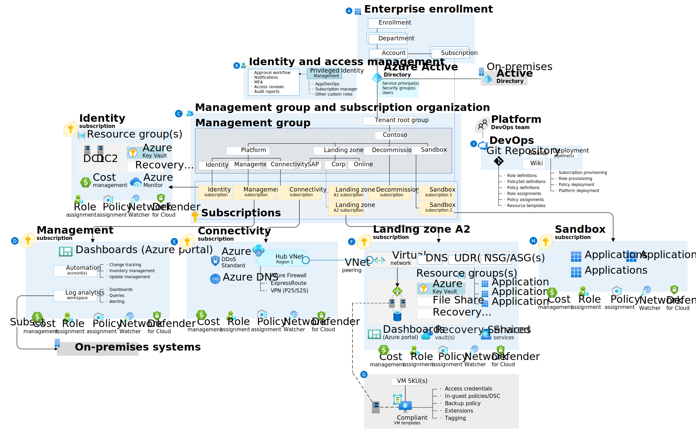

# Platform landing zone accelerator

There's a ready-made deployment experience called the **Azure landing zone portal accelerator**. The Azure landing zone portal accelerator deploys the conceptual architecture (*see figure 1*) and applies predetermined configurations to key components such as management groups and policies. It suits organizations whose conceptual architecture aligns with the planned operating model and resource structure.



You should use the Azure landing zone portal accelerator if you plan to manage your environment with the Azure portal. Deploying the Azure landing zone portal accelerator requires permissions to create resources at the tenant (`/`) scope. 

Follow the guidance in <b>Required access</b> section below:

## Required access

The principal deploying the template must have permissions to create resources at the tenant scope. The principal must have permission to execute the deployment actions (`Microsoft.Resources/deployments/*`) and to create the resources defined in the template. For example, to create a management group, the principal must have Contributor permission at the tenant scope. To create role assignments, the principal must have Owner permission.

The Global Administrator for the Microsoft Entra ID doesn't automatically have permission to assign roles. To enable template deployments at the tenant scope, the Global Administrator must do the following steps:

1. Elevate account access so the Global Administrator can assign roles. 

1. Assign Owner or Contributor to the principal that needs to deploy the templates.

   ```azurepowershell-interactive
   New-AzRoleAssignment -SignInName "[userId]" -Scope "/" -RoleDefinitionName "Owner"
   ```

   ```azurecli-interactive
   az role assignment create --assignee "[userId]" --scope "/" --role "Owner"
   ```

## Deploy on Azure

The principal now has the required permissions to deploy the template.

[](https://aka.ms/caf/ready/accelerator)


## Deleting the Azure Landing Zone

Removing the Azure Landing Zone infrastructure can be a complex task. To streamline this process, we have developed a deletion script located in the "delete" folder of our GitHub repository. You can access the script and its documentation in [Delete](https://github.com/intikhabalam/Azure-landing-zone-accelerator/) folder. This script automates the removal of all deployed infrastructure and policies created by the Azure Landing Zone platform within your subscription.

